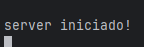

# Documentação PNHUMANS - SERVER  v0.1.2

## status = descontinuado


# Guia de instalação

Para iniciar o processo de instalação você deve ter instalado no seu computador ou servidor o **Nodejs 20.14**

## Instalar Nodejs no windows

### Download Nodejs

link para download: [https://nodejs.org/en/download/prebuilt-installer](https://nodejs.org/en/download/prebuilt-installer)

- Escolha a versão 20.14 do Nodejs
- Escolha seu sistema operacional
- Escolha a versão do seu sistema
- Clique em **Download Node.js v20.14.**


## Instalar Nodejs no Linux

Baseados em Debian/Ubuntu

no terminal

```bash
curl -o- https://raw.githubusercontent.com/nvm-sh/nvm/v0.39.7/install.sh | bash
nvm install 20
```

Feche o terminal caso esteja usando linux no modo interface(**Desktop**), caso esteja usando somente no modo terminal(**server**) reinicie a maquina.

Agora teste se a instalação deu certo.

```bash
node -v
```

## Configurando Variáveis de Ambiente

crie um arquivo na raiz do protejo chamando **.env** dentro do arquivo coloque a seguinte configuração.

```
API_PORT = "4700"
```

Essa e a configuração da porta do servidor, escolha uma porta que não esteja em uso e que não corra o risco de nenhuma outra aplicação usar pois pode ocorrer o risco da API desligar nesse processo ou na próxima vez que ela for iniciada ocorra algum erro.

```
DATABASE_URL = "file:../database/dev.db"
```

Essa e a configuração da localização do banco de dados sqlite do servidor.

```
JWTKEY = "1234"
```
Essa é a configuração da secretkey de criação e verificação do token JWT.

```
DATABASE_KEY = "1234"
```
Essa é a configuração da secretkey de criptografia do usuario no banco de dados.

Após essa configuração o servidor está pronta para ser inicializada

## Inicializando o server

Para inicializar o servidor digite o seguinte comando no terminal

```bash
npm run deploy
```

se ocorrer tudo bem



